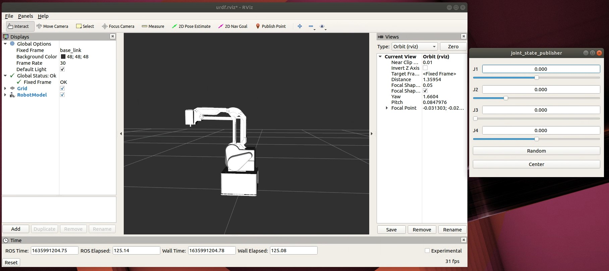

# <center>MG400Robot</center>

Chinese version of the README -> please [click here](./README-CN.md)

# Building
## Use git to clone the source code
```
cd $HOME/catkin_ws/src
git clone https://github.com/Dobot-Arm/MG400_ROS.git
cd $HOME/catkin_ws
```

## building
```
catkin_make
```

## activate this workspace
```
source $HOME/catkin_ws/devel/setup.bash
```

# run the rviz demo
```
roslaunch mg400_description display.launch
```


# Controlling real robotic arm

* **Connect the robotic arm with following command, and robot_ip is the IP address that the real arm locates**
    ```sh
    roslaunch dobot bringup.launch robot_ip:=192.168.1.6
    ```

# Custom Function Development

    Msg and srv is defined in bringup. Users can control the robotic arm via those underlying commands